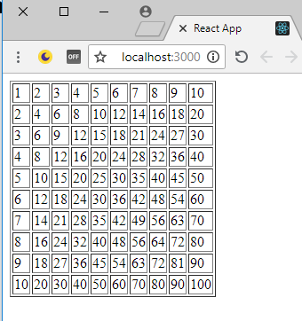

# create-react-app


## Run the app

* install all the npm packages with this command:
```bash
npm i
```
* run the app with this command:
```bash
npm start
```
* open the browser in http://localhost:3000 and see this result: 
---



## This app contains:
* public - contains `index.html` and logo
* src - 
- `registerServiceWorker.js` - a node js server that runs bt default on port 3000, and serves to the client `index.html` and `index.js`
- `index.js`:
```javascript
ReactDOM.render(<h1>Test</h1>, document.getElementById('root'));
registerServiceWorker();
```
* node_modules - this folder contains all the pkgs that we installed from `npm`
* `package.json` - contains all the specifications for the npm installtion
